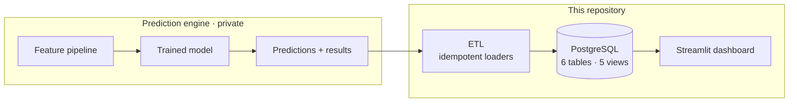
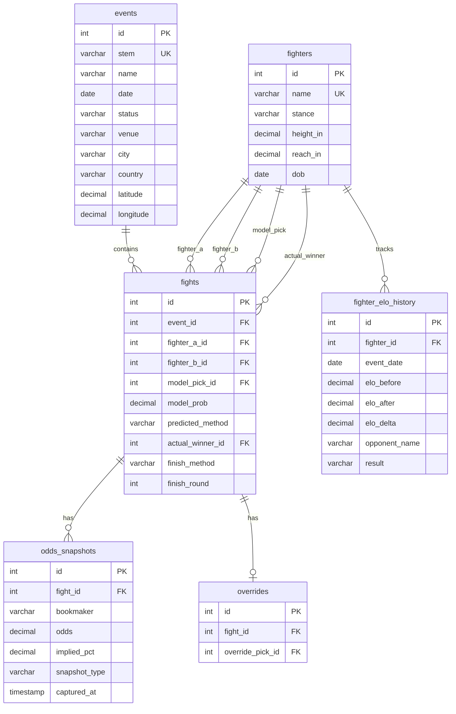

# CAGEBOT — UFC Fight Prediction, Measured Honestly

[](https://github.com/jvnteran/cagebot/actions/workflows/ci.yml)
[](https://www.python.org/downloads/)
[](https://www.postgresql.org/)
[](https://cagebot.streamlit.app)
[](LICENSE)

A machine-learning model has been predicting every UFC fight since December 2025. This
repository is the **public analytics layer** over that system: the database schema, the ETL
that loads results into it, and the Streamlit dashboard that reports how the predictions
actually performed — including where they fail.

**[→ Live dashboard](https://cagebot.streamlit.app)**

> **What this repository is.** A reference implementation of the reporting half of an ML
> system: schema design, idempotent ETL, analytical views, and a dashboard that scores a
> model against a live market. It is deliberately **not** the prediction engine. Feature
> engineering, model training, betting logic and the production automation live in a private
> repository and are not published here in any form. See [Scope](#scope).

---

## Results

Every figure below is computed from decided fights only — no contests, draws and cancelled
bouts are excluded. Predictions are recorded before each event and never revised.

| Metric | Value |
|--------|-------|
| Model accuracy | **69.9%** (221/316) |
| With human override layer | **71.8%** (227/316) |
| Override record | 75.0% (9/12) |
| Events | 26 |
| Period | Dec 2025 — Jul 2026 |

The override layer is a human-in-the-loop step: a small number of predictions per year get
reviewed and, occasionally, reversed. It is applied to roughly 4% of fights, so its
contribution is real but modest — and the sample is far too small to call it validated.

### Model evaluation

| Metric | Value | Reading |
|--------|-------|---------|
| ROC AUC | 0.739 | Discrimination — 0.5 is a coin flip |
| Brier score | 0.197 | Calibration — lower is better, 0.25 is uninformative |
| Sample | 316 decided fights | |

The dashboard's Model Evaluation page carries the calibration curve, accuracy-by-confidence
breakdown and confusion matrix behind these numbers.

### The part most projects leave out

The dashboard also reports where the model **loses**. Its picks are priced twice — at the
opening line and at the closing line — and the honest result is that the closing line is the
better forecaster on the same fights. Large model-versus-market disagreements perform worst,
not best. That comparison is on the Market Performance page, and it is there because a
prediction system that only publishes its wins is not measurable.

---

## Architecture


```mermaid
graph LR
    subgraph private [Prediction engine · private]
        A[Feature pipeline] --> B[Trained model]
        B --> C[Predictions + results]
    end
    subgraph public [This repository]
        C --> D[ETL<br/>idempotent loaders]
        D --> E[(PostgreSQL<br/>6 tables · 5 views)]
        E --> F[Streamlit dashboard]
    end
```

Predictions and outcomes are exported from the private engine as flat files. Everything in
this repository starts downstream of that boundary: it loads records, normalizes them, and
reports on them. It never trains, scores, or sizes anything.

---

## Database schema

Normalized (3NF) rather than a star schema — the workload is operational writes over a small
table, and at this row count joins are effectively free. Accuracy is computed by view at read
time instead of being stored, which removes a whole class of sync bugs.


```mermaid
erDiagram
    events ||--o{ fights : contains
    fighters ||--o{ fights : "fighter_a"
    fighters ||--o{ fights : "fighter_b"
    fighters ||--o{ fights : "model_pick"
    fighters ||--o{ fights : "actual_winner"
    fights ||--o{ odds_snapshots : has
    fights ||--o| overrides : has
    fighters ||--o{ fighter_elo_history : tracks

    events {
        int id PK
        varchar stem UK
        varchar name
        date date
        varchar status
        varchar venue
        varchar city
        varchar country
        decimal latitude
        decimal longitude
    }

    fighters {
        int id PK
        varchar name UK
        varchar stance
        decimal height_in
        decimal reach_in
        date dob
    }

    fights {
        int id PK
        int event_id FK
        int fighter_a_id FK
        int fighter_b_id FK
        int model_pick_id FK
        decimal model_prob
        varchar predicted_method
        int actual_winner_id FK
        varchar finish_method
        int finish_round
    }

    odds_snapshots {
        int id PK
        int fight_id FK
        varchar bookmaker
        decimal odds
        decimal implied_pct
        varchar snapshot_type
        timestamp captured_at
    }

    overrides {
        int id PK
        int fight_id FK
        int override_pick_id FK
    }

    fighter_elo_history {
        int id PK
        int fighter_id FK
        date event_date
        decimal elo_before
        decimal elo_after
        decimal elo_delta
        varchar opponent_name
        varchar result
    }
```

### Design decisions

| Decision | Chosen | Why |
|----------|--------|-----|
| 3NF over star schema | Normalized tables | Operational write patterns, small data, instant joins |
| Views over stored aggregates | Computed on read | Sub-millisecond queries, no aggregate drift |
| Analytics separate from the engine | Read-only downstream layer | The reporting layer cannot affect predictions |
| Rating history without an FK to events | Direct date column | History spans ~990 historical events the events table doesn't contain |
| Dashboard reads views, never base tables | Grant-enforced | The web role physically cannot select raw records |

---

## Dashboard

| Page | What it shows |
|------|---------------|
| **Overview** | Headline accuracy, per-event and cumulative trend, best contrarian calls |
| **Locations** | World map of accuracy by host city |
| **Fighters** | Fighter search with full-career rating trajectory |
| **Fights** | Filterable table of every prediction and outcome |
| **SQL Explorer** | Pre-built queries with their SQL and live results |
| **Model Evaluation** | Calibration curve, AUC, Brier score, confidence analysis |
| **Market Performance** | Model priced against the opening and closing line |

---

## Scope

This repository publishes the analytics layer and nothing else. The following are **not** in
this repository, in its history, or inferable from its outputs:

- Feature definitions, feature counts, and engineering logic
- Model architecture, hyperparameters, version lineage, and training code
- Bet selection rules, qualification gates, staking, and any per-bet record
- Production automation: schedules, orchestration, alerting, and operational tooling

The dashboard's web database role holds `SELECT` on sanitized views only; `SELECT` on base
tables is revoked. A CI guard (`tests/unit/test_public_surface.py`) fails the build if
private vocabulary or a non-public relation reaches any published file.

---

## Quick start

```bash
docker compose up -d                      # PostgreSQL on :5432

psql "$DATABASE_URL" -f schema/001_create_tables.sql
psql "$DATABASE_URL" -f schema/002_create_views.sql

python etl/load_all.py                    # requires exported CSV records

cd dashboard && streamlit run Overview.py
```

Copy `.env.example` to `.env` and set `DATABASE_URL`. The ETL expects prediction and result
records exported from the prediction engine; they are not distributed with this repository.

```bash
make test      # pytest
make lint      # ruff
```

---

## Project structure

```
cagebot/
├── schema/
│   ├── 001_create_tables.sql     # 6 tables, constraints, indexes
│   └── 002_create_views.sql      # 5 analytical views
├── etl/
│   ├── load_all.py               # orchestrator, FK-ordered
│   ├── load_fighters.py          # name normalization, physical attributes
│   ├── load_events.py            # venue + geocode backfill
│   ├── load_fights.py            # prediction/outcome join
│   ├── load_odds.py              # column-to-row pivot, opening/closing
│   ├── load_overrides.py         # override resolution
│   └── load_elo_history.py       # career rating history
├── dashboard/
│   ├── Overview.py               # entry page
│   ├── pages/                    # 6 additional pages
│   └── components/               # db access, styles, query catalog
├── tests/unit/                   # ETL, evaluation, and public-surface guard
├── docker-compose.yml
└── Dockerfile
```

---

MIT licensed. Built by [Juan Vicente Navas Teran](https://github.com/jvnteran).
